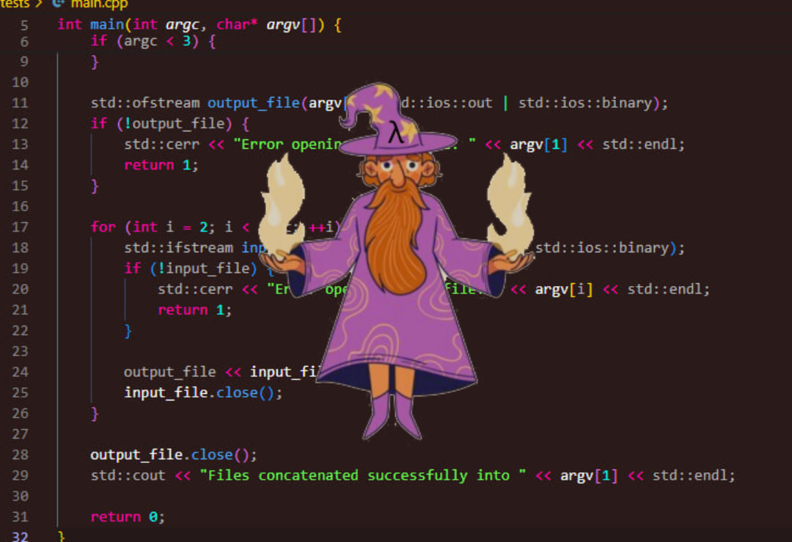
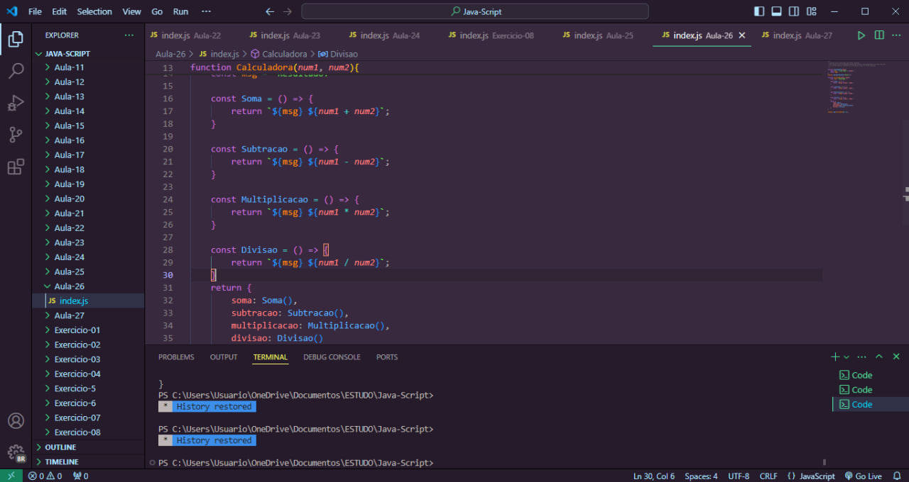

# NekoVsTheme 🚀  

A minimalist theme with strong colors made by me especially for you.

NekoVsTheme offers multiple theme options, from the simplest to the most flashy, always editing themes and bringing new themes so that you never get bored with our themes. 

Develop your applications in a more pleasant environment, with several theme options for you to choose from.

## Easy Installation

1. Open the extensions sidebar on Visual Studio Code

2. Search for NekoVsTheme

3. Click Install to install it.

4. Click Reload to reload your editor.

5. Code/File ＞ Preferences ＞ Color Theme ＞ NekoVsTheme.

6. and if you like it, rate us 5 stars on the marketplace ❤️
